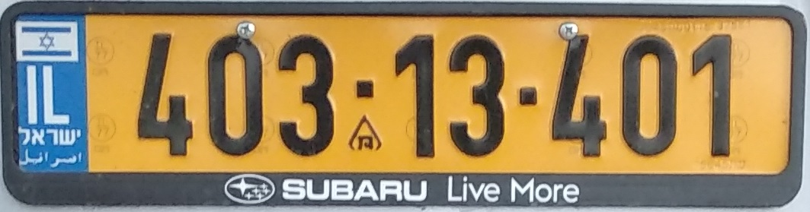

# :oncoming_taxi: LPRIL  :oncoming_taxi:
The purpose of this project is to create a 
Licence Plate Recognition system for the israeli licence plate

##### Table of Contents  
> [general-info](#general-info)  
[Insights](#insights)  
[Dataset](#dataset)  
[Experiments](#experiments)  
[Best model and wights](#best-model-and-wights)

[[_TOC_]]

## general-info
 The LP consists of 7-8 digits ranging from 0-9 
 
 here is an Example:
 
 
  

## Insights
* Screws on the license plate can be confusing
* Splitting letters and digits recognition to 2 different networks is a good idea
* Deeper network allows the network to generalize better.
* It is not a good idea to create the test/validation sets
by splitting a bigger dataset evey training cycle. the reason is that if you add more data your validation 
dataset might be a little different. this causes inconsistent results     
 
## Dataset 
* Training set: 
* Validation set:
* Test sets:  
    * Easy: 
    * Medium:
    * Hard: 
 
## Experiments

| Exp        | Results         | TakeAway  |
| ------------- |:-------------:| -----:|
| col 3 is      | right-aligned | $1600 |
| col 2 is      | centered      |   $12 |
| zebra stripes | are neat      |    $1 |

#### Viewing TensorBoard Exp results

```python
from tensorboard import program
tb = program.TensorBoard()
results_path = r"" # Take link from above table
tb.configure(argv=[None, '--logdir', results_path])
url = tb.launch()
print(f"TensorBoard listening on {url}")
input("Press any key to terminate program")
```
## Best model and wights


